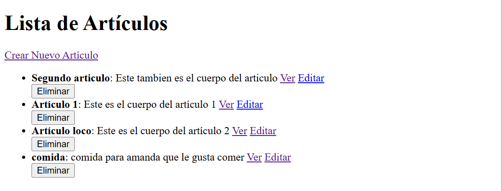

```markdown
# Proyecto CRUD en Ruby on Rails

Este proyecto es una aplicación web simple que implementa un sistema CRUD (Crear, Leer, Actualizar, Eliminar) para gestionar artículos. Es ideal para aprender los conceptos básicos de Ruby on Rails.

## Requisitos Previos

- Ruby instalado (versión 3.0+ recomendada)
- Ruby on Rails instalado (versión 7.0+ recomendada)
- SQLite o cualquier base de datos compatible con Rails
- Node.js y Yarn (para gestionar JavaScript y CSS)

## Pasos para Crear el Proyecto

### 1. Crear una Nueva Aplicación Rails

```bash
rails new blog
cd blog
```

### 2. Generar el Modelo `Article`

```bash
rails generate model Article title:string body:text
rails db:migrate
```

Esto crea una tabla `articles` en la base de datos con las columnas `title` y `body`.

### 3. Generar el Controlador `Articles`

```bash
rails generate controller Articles
```

Esto crea el controlador donde implementaremos las acciones para manejar los artículos.

### 4. Configurar las Rutas

Edita el archivo `config/routes.rb` para definir las rutas RESTful:

```ruby
Rails.application.routes.draw do
  resources :articles
end
```

Esto genera automáticamente todas las rutas necesarias para el CRUD de artículos.

### 5. Implementar el Controlador

Edita el archivo `app/controllers/articles_controller.rb` y agrega las acciones necesarias:

```ruby
class ArticlesController < ApplicationController
  def index
    @articles = Article.all
  end

  def show
    @article = Article.find(params[:id])
  end

  def new
    @article = Article.new
  end

  def create
    @article = Article.new(article_params)
    if @article.save
      redirect_to @article, notice: 'Artículo creado con éxito.'
    else
      render :new, status: :unprocessable_entity
    end
  end

  def edit
    @article = Article.find(params[:id])
  end

  def update
    @article = Article.find(params[:id])
    if @article.update(article_params)
      redirect_to @article, notice: 'Artículo actualizado con éxito.'
    else
      render :edit, status: :unprocessable_entity
    end
  end

  def destroy
    @article = Article.find(params[:id])
    @article.destroy
    redirect_to articles_path, notice: 'Artículo eliminado con éxito.'
  end

  private

  def article_params
    params.require(:article).permit(:title, :body)
  end
end
```

### 6. Crear las Vistas

#### **Lista de Artículos (`index.html.erb`):**
En `app/views/articles/index.html.erb`:

```erb
<h1>Lista de Artículos</h1>

<%= link_to 'Crear Nuevo Artículo', new_article_path %>

<% if @articles.present? %>
  <ul>
    <% @articles.each do |article| %>
      <li>
        <strong><%= article.title %></strong>: <%= article.body %>
        <%= link_to 'Ver', article_path(article) %>
        <%= link_to 'Editar', edit_article_path(article) %>
        <%= form_with model: article, method: :delete, local: true do %>
          <%= submit_tag 'Eliminar', data: { confirm: '¿Estás seguro?' } %>
        <% end %>
      </li>
    <% end %>
  </ul>
<% else %>
  <p>No hay artículos disponibles.</p>
<% end %>
```

#### **Mostrar un Artículo (`show.html.erb`):**
En `app/views/articles/show.html.erb`:

```erb
<h1><%= @article.title %></h1>
<p><%= @article.body %></p>
<%= link_to 'Volver a la Lista', articles_path %>
<%= link_to 'Editar', edit_article_path(@article) %>
<%= form_with model: @article, method: :delete, local: true do %>
  <%= submit_tag 'Eliminar', data: { confirm: '¿Estás seguro?' } %>
<% end %>
```

#### **Formulario para Crear y Editar (`new.html.erb` y `edit.html.erb`):**
Ambos formularios comparten el mismo código base. En `new.html.erb` y `edit.html.erb`:

```erb
<h1><%= @article.new_record? ? 'Crear Nuevo Artículo' : 'Editar Artículo' %></h1>

<%= form_with model: @article, local: true do |form| %>
  <% if @article.errors.any? %>
    <div>
      <h2><%= pluralize(@article.errors.count, "error") %> impidieron guardar el artículo:</h2>
      <ul>
        <% @article.errors.full_messages.each do |message| %>
          <li><%= message %></li>
        <% end %>
      </ul>
    </div>
  <% end %>

  <div>
    <%= form.label :title %><br>
    <%= form.text_field :title %>
  </div>

  <div>
    <%= form.label :body %><br>
    <%= form.text_area :body %>
  </div>

  <div>
    <%= form.submit %>
  </div>
<% end %>

<%= link_to 'Volver a la Lista', articles_path %>
```

### 7. Inicia el Servidor

Ejecuta el servidor con:

```bash
rails server
```

Accede a la aplicación en `http://localhost:3000/articles`.

---

## Comandos Importantes

| Comando                                  | Descripción                                      |
|------------------------------------------|--------------------------------------------------|
| `rails new blog`                         | Crea una nueva aplicación Rails                 |
| `rails generate model Article title:string body:text` | Crea el modelo y la migración para artículos   |
| `rails db:migrate`                       | Aplica las migraciones en la base de datos      |
| `rails generate controller Articles`     | Genera un controlador para manejar artículos    |
| `rails server`                           | Inicia el servidor Rails                        |

---

## Notas Finales

Este proyecto es una introducción al desarrollo web con Ruby on Rails. 

